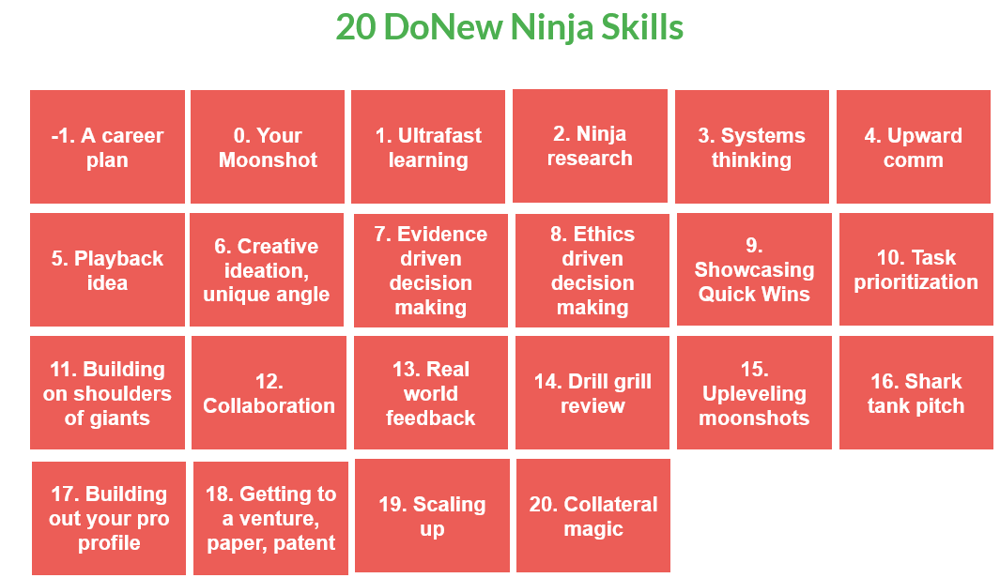

# Ninja Skills



Prompt used

```
You are an expert Career Coach especially for those who are building their new career. Please give guidance regarding TASK mention below. Be very precise, concise and point-wise.

## TASK
Attached picture has 20 skills called as Ninja skills needed to be successful in the career. Please ocr them. For each skill create learning plan, a short checklist, recommended resources, metrics for outcome evaluation etc. Be concise, precise and point wise.
```

---

### **-1. A Career Plan**
- **Learning Plan**: Research career paths, assess strengths/interests, and set SMART goals.
- **Checklist**:
  - Assess skills and passions.
  - Identify industry trends.
  - Draft a 5-year plan.
- **Resources**:  
  - "Designing Your Life" by Bill Burnett.  
  - Career aptitude tests (e.g., MBTI, StrengthsFinder).
- **Metrics**: Clear milestones for each year, review progress bi-annually.

---

### **0. Your Moonshot**
- **Learning Plan**: Think big and define a transformational goal.  
- **Checklist**:  
  - Identify a high-impact vision.  
  - Break it into actionable steps.  
  - Align with personal values.  
- **Resources**:  
  - "Moonshots" by Naveen Jain.  
  - TED Talks on innovation.  
- **Metrics**: Feasibility and clarity of the moonshot plan.

---

### **1. Ultrafast Learning**
- **Learning Plan**: Master speed learning techniques.  
- **Checklist**:  
  - Practice active recall.  
  - Use the Feynman technique.  
  - Time-block learning sessions.  
- **Resources**:  
  - "Make It Stick" by Peter C. Brown.  
  - Coursera course: Learning How to Learn.  
- **Metrics**: Test performance, speed of knowledge acquisition.

---

### **2. Ninja Research**
- **Learning Plan**: Develop deep-dive research skills.  
- **Checklist**:  
  - Use advanced search queries.  
  - Validate sources for credibility.  
  - Summarize insights effectively.  
- **Resources**:  
  - Google Advanced Search tutorials.  
  - Research databases (e.g., JSTOR).  
- **Metrics**: Quality and accuracy of findings.

---

### **3. Systems Thinking**
- **Learning Plan**: Learn to analyze interconnections.  
- **Checklist**:  
  - Identify system components.  
  - Map out processes.  
  - Predict outcomes.  
- **Resources**:  
  - "Thinking in Systems" by Donella Meadows.  
  - Online tools like Miro.  
- **Metrics**: Effective system maps and process optimizations.

---

### **4. Upward Communication**
- **Learning Plan**: Develop concise and clear communication skills for leadership.  
- **Checklist**:  
  - Use active listening.  
  - Structure concise reports.  
  - Align with leadership goals.  
- **Resources**:  
  - Toastmasters.  
  - "Crucial Conversations" by Patterson et al.  
- **Metrics**: Feedback from managers, improved leadership trust.

---

### **5. Playback Idea**
- **Learning Plan**: Sharpen articulation and summarization of ideas.  
- **Checklist**:  
  - Practice summarizing key points.  
  - Request feedback on clarity.  
  - Use storytelling techniques.  
- **Resources**:  
  - "Storytelling with Data" by Cole Nussbaumer Knaflic.  
- **Metrics**: Audience engagement and clarity ratings.

---

### **6. Creative Ideation, Unique Angle**
- **Learning Plan**: Foster creativity in problem-solving.  
- **Checklist**:  
  - Brainstorm without judgment.  
  - Combine unrelated concepts.  
  - Use SCAMPER technique.  
- **Resources**:  
  - "Creative Confidence" by Tom Kelley.  
  - Mind-mapping tools.  
- **Metrics**: Novelty and feasibility of ideas.

---

### **7. Evidence-Driven Decision Making**
- **Learning Plan**: Base decisions on data and analysis.  
- **Checklist**:  
  - Gather relevant data.  
  - Analyze trends objectively.  
  - Avoid cognitive biases.  
- **Resources**:  
  - Coursera: Data Analytics for Decision Making.  
  - "Factfulness" by Hans Rosling.  
- **Metrics**: Success rate of decisions.

---

### **8. Ethics-Driven Decision Making**
- **Learning Plan**: Apply ethical principles consistently.  
- **Checklist**:  
  - Review implications of choices.  
  - Consult codes of ethics.  
  - Ensure transparency.  
- **Resources**:  
  - "Justice" by Michael Sandel.  
  - Ethical frameworks (e.g., Kantianism, Utilitarianism).  
- **Metrics**: Positive stakeholder feedback.

---

### **9. Showcasing Quick Wins**
- **Learning Plan**: Highlight immediate results to build momentum.  
- **Checklist**:  
  - Identify low-hanging fruits.  
  - Communicate impact clearly.  
  - Align with stakeholder priorities.  
- **Resources**:  
  - "The First 90 Days" by Michael Watkins.  
- **Metrics**: Stakeholder satisfaction.

---

### **10. Task Prioritization**
- **Learning Plan**: Master prioritization frameworks.  
- **Checklist**:  
  - Use Eisenhower Matrix.  
  - Define critical vs. non-critical tasks.  
  - Reassess priorities weekly.  
- **Resources**:  
  - "Getting Things Done" by David Allen.  
  - Trello, Asana for task tracking.  
- **Metrics**: On-time task completion.

---

### **11. Building on Shoulders of Giants**
- **Learning Plan**: Leverage existing knowledge and frameworks.  
- **Checklist**:  
  - Study works of experts in your field.  
  - Identify key frameworks or benchmarks.  
  - Build upon proven ideas.  
- **Resources**:  
  - "Steal Like an Artist" by Austin Kleon.  
  - ResearchGate, Google Scholar.  
- **Metrics**: Incorporation of proven concepts into your work.

---

### **12. Collaboration**
- **Learning Plan**: Develop effective teamwork and collaboration skills.  
- **Checklist**:  
  - Use active listening and empathy.  
  - Leverage complementary strengths.  
  - Maintain open communication.  
- **Resources**:  
  - "Team of Teams" by Stanley McChrystal.  
  - Slack, Microsoft Teams for coordination.  
- **Metrics**: Successful team outcomes and feedback.

---

### **13. Real-World Feedback**
- **Learning Plan**: Gather and act on practical insights.  
- **Checklist**:  
  - Collect feedback through surveys or reviews.  
  - Analyze and categorize feedback.  
  - Implement necessary improvements.  
- **Resources**:  
  - "The Lean Startup" by Eric Ries.  
  - Tools like Google Forms, Typeform.  
- **Metrics**: Quality of iteration based on feedback.

---

### **14. Drill Grill Review**
- **Learning Plan**: Regularly assess and refine performance.  
- **Checklist**:  
  - Schedule practice sessions.  
  - Simulate real scenarios.  
  - Identify areas for improvement.  
- **Resources**:  
  - "Atomic Habits" by James Clear.  
  - Role-playing or mock drills.  
- **Metrics**: Performance improvements over iterations.

---

### **15. Upleveling Moonshots**
- **Learning Plan**: Enhance and scale transformational ideas.  
- **Checklist**:  
  - Identify growth opportunities.  
  - Seek expert advice.  
  - Expand resources and scope.  
- **Resources**:  
  - "Exponential Organizations" by Salim Ismail.  
  - Growth-focused workshops.  
- **Metrics**: Progress in achieving scaled objectives.

---

### **16. Shark Tank Pitch**
- **Learning Plan**: Master persuasive pitching techniques.  
- **Checklist**:  
  - Create a compelling narrative.  
  - Address key concerns proactively.  
  - Use visuals effectively.  
- **Resources**:  
  - "Pitch Anything" by Oren Klaff.  
  - YouTube videos of Shark Tank pitches.  
- **Metrics**: Investor/stakeholder interest.

---

### **17. Building Out Your Pro Profile**
- **Learning Plan**: Establish a strong professional presence.  
- **Checklist**:  
  - Update LinkedIn and portfolio.  
  - Publish articles or blogs.  
  - Network actively.  
- **Resources**:  
  - LinkedIn Learning: Building a Professional Profile.  
  - Personal branding books like "Me 2.0" by Dan Schawbel.  
- **Metrics**: Profile visits, connection growth, and engagement.

---

### **18. Getting to a Venture, Paper, Patent**
- **Learning Plan**: Work towards a tangible outcome in innovation.  
- **Checklist**:  
  - Conduct thorough market/academic research.  
  - Collaborate with mentors or experts.  
  - Follow formal procedures for filing.  
- **Resources**:  
  - WIPO Patent Database.  
  - Journals like IEEE, Springer.  
- **Metrics**: Submission/acceptance of a paper or patent.

---

### **19. Scaling Up**
- **Learning Plan**: Strategize for growth and sustainability.  
- **Checklist**:  
  - Create scalable processes.  
  - Invest in automation.  
  - Build a robust team.  
- **Resources**:  
  - "Scaling Up" by Verne Harnish.  
  - Courses on business scaling.  
- **Metrics**: Revenue growth, scalability metrics.

---

### **20. Collateral Magic**
- **Learning Plan**: Unlock hidden potential from existing assets.  
- **Checklist**:  
  - Audit all resources.  
  - Repurpose underutilized assets.  
  - Leverage tools for efficiency.  
- **Resources**:  
  - "The Art of Resourcefulness" by Tony Zeiss.  
  - Tools like Zapier, Notion for productivity.  
- **Metrics**: Increased value derived from resources.

--- 

